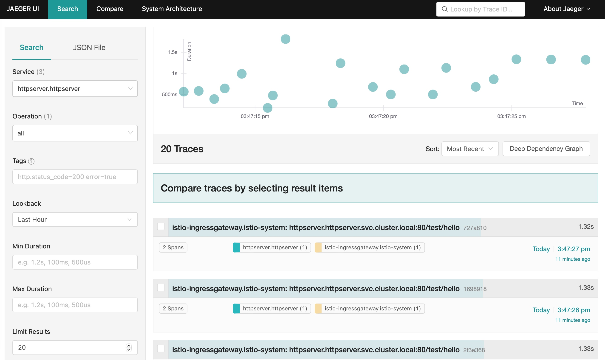
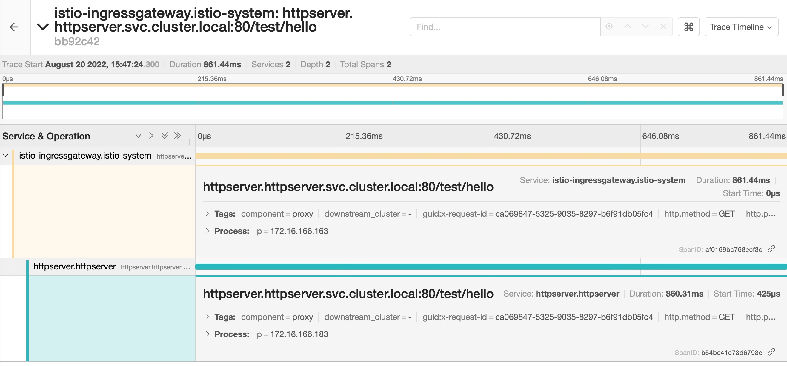

# 题目
把我们的 httpserver 服务以 Istio Ingress Gateway 的形式发布出来。以下是你需要考虑的几点：

- 如何实现安全保证；
- 七层路由规则；
- 考虑 open tracing 的接入。

## 操作步骤
### 安装istio
```bash
# istioctl version
client version: 1.14.3
control plane version: 1.14.3
data plane version: 1.14.3 (3 proxies)
```
创建namespace: httpserver，并打开istio注入：
```bash
# k create ns httpserver
# k label ns httpserver istio-injection=enabled
```
### 部署httpserver
以下为deployment和service的yaml文件内容：
```yaml
apiVersion: apps/v1
kind: Deployment
metadata:
  name: httpserver
spec:
  replicas: 1
  selector:
    matchLabels:
      app: httpserver
  template:
    metadata:
      annotations:
        prometheus.io/scrape: "true"
        prometheus.io/port: "80"
      labels:
        app: httpserver
    spec:
      imagePullSecrets:
        - name: regcred
      containers:
        - name: httpserver
          image: kuopenx/httpserver:v1.0-metrics
          ports:
            - containerPort: 80
---
apiVersion: v1
kind: Service
metadata:
  name: httpserver
spec:
  ports:
    - name: http
      port: 80
      protocol: TCP
      targetPort: 80
  selector:
    app: httpserver
```
执行命令：
```bash
# k create -f httpserver-deployment-service.yaml -n httpserver
deployment.apps/httpserver created
service/httpserver created

# k get pod -n httpserver
NAME                         READY   STATUS    RESTARTS   AGE
httpserver-78d5866d6-jj78k   2/2     Running   0          9s

# k get deploy -n httpserver
NAME         READY   UP-TO-DATE   AVAILABLE   AGE
httpserver   1/1     1            1           108s

# k get svc -n httpserver
NAME         TYPE        CLUSTER-IP    EXTERNAL-IP   PORT(S)   AGE
httpserver   ClusterIP   10.1.238.45   <none>        80/TCP    102s
```
### 部署gateway并且暴露服务
以下为VirtualService和Gateway的yaml文件内容：
```yaml
apiVersion: networking.istio.io/v1beta1
kind: VirtualService
metadata:
  name: httpsserver
spec:
  gateways:
    - httpsserver
  hosts:
    - httpsserver.kuopenx.io
  http:
    - match:
      - uri:
          exact: "/test/hello"
      rewrite:
        uri: "/hello"
      route:
        - destination:
            host: httpserver.httpserver.svc.cluster.local
            port:
              number: 80
    - match:
      - uri:
          prefix: "/test/metrics"
      rewrite:
        uri: "/metrics"
      route:
        - destination:
            host: httpserver.httpserver.svc.cluster.local
            port:
              number: 80
---
apiVersion: networking.istio.io/v1beta1
kind: Gateway
metadata:
  name: httpsserver
spec:
  selector:
    istio: ingressgateway
  servers:
    - hosts:
        - httpsserver.kuopenx.io
      port:
        name: https-default
        number: 443
        protocol: HTTPS
      tls:
        mode: SIMPLE
        credentialName: httpserver-credential
```
执行命令：
```bash
# k create -f httpserver-virtualservice-gateway.yaml -n istio-system
virtualservice.networking.istio.io/httpsserver created
gateway.networking.istio.io/httpsserver created

# k get virtualservice -n istio-system
NAME          GATEWAYS          HOSTS                        AGE
httpsserver   ["httpsserver"]   ["httpsserver.kuopenx.io"]   30s

# k get gateway -n istio-system
NAME          AGE
httpsserver   46s
```
#### 自动签名：使用letsencrypt申请一张证书
在istio-system中配置issuer:
```yaml
apiVersion: cert-manager.io/v1
kind: Issuer
metadata:
  name: letsencrypt-prod
spec:
  acme:
    email: guopeng.xue@foxmail.com
    preferredChain: ""
    privateKeySecretRef:
      name: letsencrypt-prod
    server: https://acme-v02.api.letsencrypt.org/directory
    solvers:
      - http01:
          ingress:
            class: istio
```
执行命令：
```bash
# k create -f istio-issuer.yaml -n istio-system
issuer.cert-manager.io/letsencrypt-prod created

# k get issuer -n istio-system
NAME               READY   AGE
letsencrypt-prod   True    54s
```
在istio-system中配置certificate：
```yaml
apiVersion: cert-manager.io/v1
kind: Certificate
metadata:
  name: httpserver
spec:
  dnsNames:
    - httpsserver.kuopenx.io
  issuerRef:
    group: cert-manager.io
    kind: Issuer
    name: letsencrypt-prod
  secretName: httpserver-credential
  usages:
    - digital signature
    - key encipherment
```
执行命令：
```bash
# k create -f istio-cert.yaml -n istio-system
certificate.cert-manager.io/httpserver created

# k get cert -n istio-system
NAME         READY   SECRET                  AGE
httpserver   False   httpserver-credential   84m
```
#### 手动签发证书
```bash
# openssl req -x509 -sha256 -nodes -days 365 -newkey rsa:2048 -subj '/O=kuopenx Inc./CN=*.kuopenx.io' -keyout kuopenx.io.key -out kuopenx.io.crt
Generating a RSA private key
...............................+++++
..............+++++
writing new private key to 'kuopenx.io.key'
-----

# k create -n istio-system secret tls httpserver-credential --key=kuopenx.io.key --cert=kuopenx.io.crt
secret/httpserver-credential created

# k get secret httpserver-credential -n istio-system 
NAME                    TYPE                DATA   AGE
httpserver-credential   kubernetes.io/tls   2      72s
```
#### 验证
```bash
# curl --resolve httpsserver.kuopenx.io:443:10.1.19.73 https://httpsserver.kuopenx.io/test/hello -k
hello.

# curl --resolve httpsserver.kuopenx.io:443:10.1.19.73 https://httpsserver.kuopenx.io/test/metrics -k
# HELP go_gc_duration_seconds A summary of the pause duration of garbage collection cycles.
# TYPE go_gc_duration_seconds summary
go_gc_duration_seconds{quantile="0"} 0
go_gc_duration_seconds{quantile="0.25"} 0
go_gc_duration_seconds{quantile="0.5"} 0
go_gc_duration_seconds{quantile="0.75"} 0
go_gc_duration_seconds{quantile="1"} 0
go_gc_duration_seconds_sum 0
go_gc_duration_seconds_count 0
......
promhttp_metric_handler_requests_total{code="200"} 0
promhttp_metric_handler_requests_total{code="500"} 0
promhttp_metric_handler_requests_total{code="503"} 0
```
### 接入 open tracing



