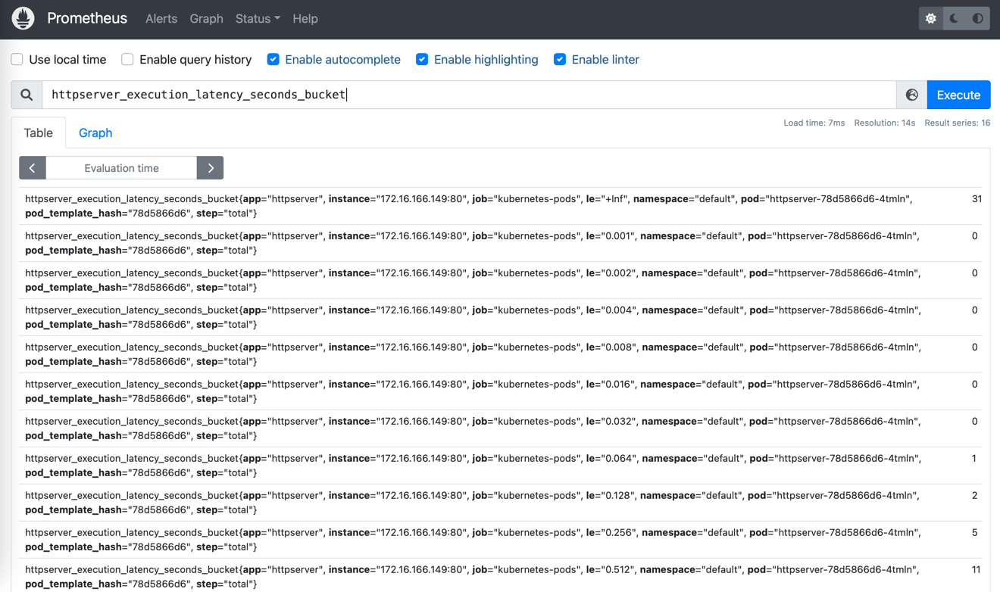
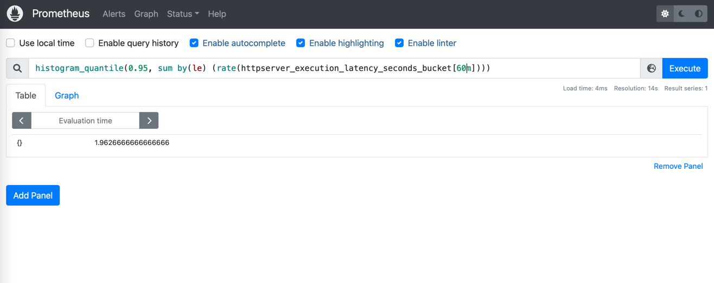

# 题目
1. 为 HTTPServer 添加 0-2 秒的随机延时；
2. 为 HTTPServer 项目添加延时 Metric；
3. 将 HTTPServer 部署至测试集群，并完成 Prometheus 配置；
4. 从 Promethus 界面中查询延时指标数据；
5. （可选）创建一个 Grafana Dashboard 展现延时分配情况。

## 操作步骤
1. main.go文件中，已经为url path为hello的handler，添加了2s以内的随机延时。
2. main.go文件中，导入并使用了prometheus代码库，并注册了处理时延的收集器，编写了时间统计的逻辑。
3. 编写了metrics-deployment.yaml文件（在仓库根目录中），用于部署在集群中，由于拉取的是私有镜像，因此需要读取集群中配置好的secret凭证。以下为部署后的yaml状态：
```yaml
k get po httpserver-78d5866d6-4tmln -oyaml
apiVersion: v1
kind: Pod
metadata:
  annotations:
    cni.projectcalico.org/containerID: 11731aa2b7ca0206b0e1aeb805f89ba8b072956b8948f30b089760502ad672a9
    cni.projectcalico.org/podIP: 172.16.166.149/32
    cni.projectcalico.org/podIPs: 172.16.166.149/32
    prometheus.io/port: "80"
    prometheus.io/scrape: "true"
  creationTimestamp: "2022-08-01T17:35:37Z"
  generateName: httpserver-78d5866d6-
  labels:
    app: httpserver
    pod-template-hash: 78d5866d6
  name: httpserver-78d5866d6-4tmln
  namespace: default
  ownerReferences:
  - apiVersion: apps/v1
    blockOwnerDeletion: true
    controller: true
    kind: ReplicaSet
    name: httpserver-78d5866d6
    uid: ff7fab60-c620-4d93-8a2e-ce1c47360795
  resourceVersion: "738218"
  uid: 194b9f28-8ccb-4706-aaa7-9404933302d4
spec:
  containers:
  - image: kuopenx/httpserver:v1.0-metrics
    imagePullPolicy: IfNotPresent
    name: httpserver
    ports:
    - containerPort: 80
      protocol: TCP
    resources: {}
    terminationMessagePath: /dev/termination-log
    terminationMessagePolicy: File
    volumeMounts:
    - mountPath: /var/run/secrets/kubernetes.io/serviceaccount
      name: kube-api-access-ftv4l
      readOnly: true
  dnsPolicy: ClusterFirst
  enableServiceLinks: true
  imagePullSecrets:
  - name: regcred
  nodeName: node1
  preemptionPolicy: PreemptLowerPriority
  priority: 0
  restartPolicy: Always
  schedulerName: default-scheduler
  securityContext: {}
  serviceAccount: default
  serviceAccountName: default
  terminationGracePeriodSeconds: 30
  tolerations:
  - effect: NoExecute
    key: node.kubernetes.io/not-ready
    operator: Exists
    tolerationSeconds: 300
  - effect: NoExecute
    key: node.kubernetes.io/unreachable
    operator: Exists
    tolerationSeconds: 300
  volumes:
  - name: kube-api-access-ftv4l
    projected:
      defaultMode: 420
      sources:
      - serviceAccountToken:
          expirationSeconds: 3607
          path: token
      - configMap:
          items:
          - key: ca.crt
            path: ca.crt
          name: kube-root-ca.crt
      - downwardAPI:
          items:
          - fieldRef:
              apiVersion: v1
              fieldPath: metadata.namespace
            path: namespace
status:
  conditions:
  - lastProbeTime: null
    lastTransitionTime: "2022-08-01T17:35:37Z"
    status: "True"
    type: Initialized
  - lastProbeTime: null
    lastTransitionTime: "2022-08-01T17:35:51Z"
    status: "True"
    type: Ready
  - lastProbeTime: null
    lastTransitionTime: "2022-08-01T17:35:51Z"
    status: "True"
    type: ContainersReady
  - lastProbeTime: null
    lastTransitionTime: "2022-08-01T17:35:37Z"
    status: "True"
    type: PodScheduled
  containerStatuses:
  - containerID: containerd://72a69d6504fd3f4009a7c45f44c84e2165c2f7db53470beee546168430880404
    image: docker.io/kuopenx/httpserver:v1.0-metrics
    imageID: docker.io/kuopenx/httpserver@sha256:5244f8f650c4d50abfdc6027c40f55a427571aa96c94efc8addd09f6f05c8366
    lastState: {}
    name: httpserver
    ready: true
    restartCount: 0
    started: true
    state:
      running:
        startedAt: "2022-08-01T17:35:51Z"
  hostIP: 192.168.34.23
  phase: Running
  podIP: 172.16.166.149
  podIPs:
  - ip: 172.16.166.149
  qosClass: BestEffort
  startTime: "2022-08-01T17:35:37Z"
```
以下为安装好的loki和prometheus组件pod：
```shell
# k get po
NAME                                            READY   STATUS    RESTARTS   AGE
httpserver-78d5866d6-4tmln                      1/1     Running   0          22h
loki-0                                          1/1     Running   0          44m
loki-grafana-54d694c54d-vc4kc                   2/2     Running   0          44m
loki-kube-state-metrics-7448968777-5t95r        1/1     Running   0          44m
loki-prometheus-alertmanager-7c5d7d5849-ccr2c   2/2     Running   0          44m
loki-prometheus-node-exporter-xdhc5             1/1     Running   0          44m
loki-prometheus-pushgateway-dcb478496-nwrgt     1/1     Running   0          44m
loki-prometheus-server-7cf7dcf794-qxbkc         2/2     Running   0          44m
loki-promtail-f6wd2                             1/1     Running   0          44m
loki-promtail-tjgcw                             1/1     Running   0          44m
```
暴露的services如下：
```shell
~# k get svc
NAME                            TYPE        CLUSTER-IP     EXTERNAL-IP   PORT(S)        AGE
kubernetes                      ClusterIP   10.1.0.1       <none>        443/TCP        9d
loki                            ClusterIP   10.1.23.173    <none>        3100/TCP       7m45s
loki-grafana                    NodePort    10.1.30.35     <none>        80:32616/TCP   7m45s
loki-headless                   ClusterIP   None           <none>        3100/TCP       7m45s
loki-kube-state-metrics         ClusterIP   10.1.139.97    <none>        8080/TCP       7m45s
loki-memberlist                 ClusterIP   None           <none>        7946/TCP       7m45s
loki-prometheus-alertmanager    ClusterIP   10.1.59.197    <none>        80/TCP         7m45s
loki-prometheus-node-exporter   ClusterIP   None           <none>        9100/TCP       7m45s
loki-prometheus-pushgateway     ClusterIP   10.1.116.96    <none>        9091/TCP       7m45s
loki-prometheus-server          NodePort    10.1.161.119   <none>        80:30852/TCP   7m45s
```
4. 从prometheus界面查看延时指标数据：

